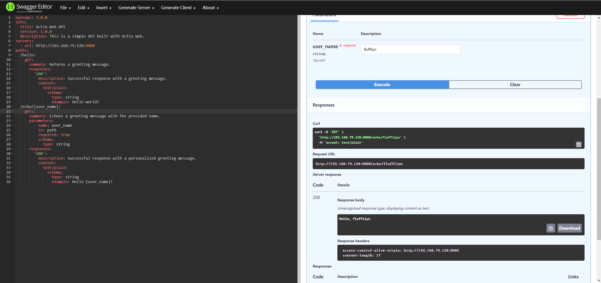

# Lab1
## Step1~Step3
使用actix库创建了一个简单的网络应用，实现了echo功能，添加了CORS支持。
```rust
use actix_web::{get, web, HttpResponse, Responder};
use actix_web::{App, HttpServer};
use actix_cors::Cors;
use serde::Deserialize;

#[derive(Deserialize)]
struct Info{
    user_name: String
}

#[get("/hello")]
async fn index() -> impl Responder{
    HttpResponse::Ok().body("Hello world!\n")
}

// 使用serde库将path info提取出来
#[get("/echo/{user_name}")] // 定义路径参数
async fn echo(info: web::Path<Info>) -> impl Responder{
    HttpResponse::Ok().body(format!("Hello, {}\n",info.user_name))
}

#[actix_web::main]
async fn main() -> std::io::Result<()>{

    // 启动http服务器
    HttpServer::new( || {
        App::new()
            .wrap(Cors::permissive())// 应用CORS。permissive()表示允许所有的跨域请求，仅用于本地测试
            .service(index)
            .service(echo)
    })
    .bind("0.0.0.0:8888")?
    .run()
    .await
}
```
## Step4
在docker中运行Swagger Editor，以测试上述应用的API。

